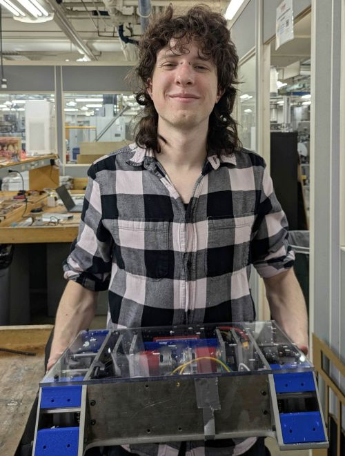

---
#
# By default, content added below the "---" mark will appear in the home page
# between the top bar and the list of recent posts.
# To change the home page layout, edit the _layouts/home.html file.
# See: https://jekyllrb.com/docs/themes/#overriding-theme-defaults
#
layout: page
---

I am a first year Master of Science in [Mechanical Engineering](https://www.meche.engineering.cmu.edu/) at [Carnegie Mellon University](https://www.cmu.edu/). I am currently doing research on Human-Robot Interaction in the [Robotics Institute](https://www.ri.cmu.edu/) with the [Robotic Caregiving and Human Interaction (RCHI) lab](https://rchi-lab.github.io/), focusing on assistive robotics and communication of robotic intent.

I previously graduated from the [California Institute of Technology (Caltech)](https://www.caltech.edu/) with a Bachelor of Science in Mechanical Engineering. During my time at Caltech, I conducted Robotic Machine Learning research with the [Autonomous Robotics and Controls Lab (ARCL)](https://aerospacerobotics.caltech.edu/) and Robotic Hardware research with the [Advanced Mechanical Experimental Robotics (AMBER) Lab](http://www.bipedalrobotics.com/).

---

### Contact

**Email**: [julian.millan729@gmail.com](mailto:julian.millan729@gmail.com)

**Linkedin**: [https://www.linkedin.com/in/julian-millan-782802257]

**Github**: [https://github.com/julian-millan]

---

### Research

---

### Extra links
